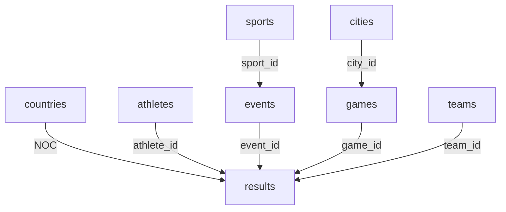

# Olympics Data Analysis

A comprehensive data analysis project for Olympic Games historical data, developed by Ahmed Abdelwahed as an assessment project for Stage One of the Data Engineering track @IEEE Mansoura Computer Society Chapter.

## Project Description

This project provides a robust system for analyzing historical Olympic Games data, including athlete performance, medal distributions, and participation trends across different sports and countries. It features a complete data pipeline from raw data processing to insightful visualizations, all backed by a well-structured MySQL database.

## Tech Stack


- **Programming Language**: Python 3.11
- **Data Processing**:
  - Pandas
  - NumPy
- **Database**:
  - MySQL
  - SQLAlchemy
- **Data Visualization**:
  - Matplotlib
  - Seaborn
- **Development Environment**:
  - JupyterLab
  - IPython Kernel

## Installation

1. Clone the repository:

   ```bash
   git clone https://github.com/yourusername/Olympics-Data-Analysis.git
   cd Olympics-Data-Analysis
   ```

2. Create and activate the Conda environment:

   ```bash
   conda env create -f environment.yml
   conda activate olympics-project
   ```

3. Set up MySQL database:
   - Install MySQL if not already installed
   - Create a new database named `olympics_db`
   - Update the database configuration in `scripts/config.py` with your MySQL credentials:

     ```python
     MYSQL_CONFIG = {
         'host': 'localhost',
         'port': 3306,
         'user': 'your_username',
         'password': 'your_password',
         'database': 'olympics_db'
     }
     ```

## Usage

The project follows a sequential workflow:

1. Create the database schema:

   ```bash
   python scripts/create_schema.py
   ```

2. Load the initial data:

   ```bash
   python scripts/load_data.py
   ```

3. Clean and process the data:

   ```bash
   python scripts/clean_data.py
   ```

4. Run the analysis:

   ```bash
   python scripts/analyze.py
   ```

The analysis results will be saved in the `analysis_results` directory as PNG files:

- `medals_by_country.png`: Top 10 countries by medal count
- `athlete_trends.png`: Athlete statistics over time
- `sports_distribution.png`: Distribution of sports and events
- `gender_distribution.png`: Gender participation trends

## Project Structure

```
Olympics-Data-Analysis/
├── analysis_results/     # Generated analysis visualizations
├── data/                 # Raw data files
│   ├── athlete_events.csv
│   └── noc_regions.csv
├── database/            # Database-related files
├── erd/                 # Entity Relationship Diagrams
├── notebooks/           # Jupyter notebook for initial exploration
├── scripts/             # Python scripts
│   ├── analyze.py       # Data analysis and visualization
│   ├── clean_data.py    # Data cleaning and processing
│   ├── config.py        # Configuration settings
│   ├── create_schema.py # Database schema creation
│   └── load_data.py     # Data loading utilities
└── task/                # Project requirements and description
```

## Database Schema

The project uses a normalized database schema with the following structure:

### Entity Relationship Diagram (ERD)


### Table Descriptions

1. **countries**
   - Primary table for country information
   - Contains NOC (National Olympic Committee) codes and regions
   - Links to results through NOC code

2. **athletes**
   - Stores athlete information
   - Contains basic demographic data
   - Links to results through athlete_id

3. **sports**
   - Master table for all Olympic sports
   - Links to events through sport_id
   - Ensures consistent sport naming

4. **events**
   - Contains all Olympic events
   - Links to sports through sport_id
   - Links to results through event_id

5. **cities**
   - Stores host city information
   - Links to games through city_id
   - Ensures consistent city naming

6. **games**
   - Contains Olympic Games information
   - Includes year and season
   - Links to cities through city_id
   - Links to results through game_id

7. **teams**
   - Stores team information
   - Links to results through team_id
   - Handles team name consistency

8. **results**
   - Core table for all Olympic results
   - Contains performance metrics (age, height, weight)
   - Links to all other tables through foreign keys
   - Stores medal information

### Key Relationships



## License

This project is part of the IEEE Mansoura Computer Society Chapter's Data Engineering track stage one evaluation process. All rights reserved.

## Additional Notes

- The project uses a MySQL database for data storage. Make sure MySQL is running before executing the scripts.
- Data files should be placed in the `data` directory before running the scripts.
- The analysis results are automatically saved in the `analysis_results` directory.
