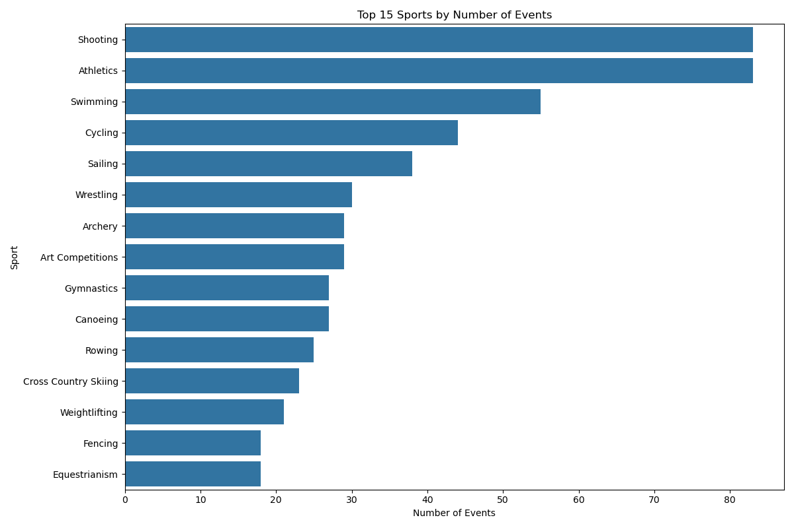
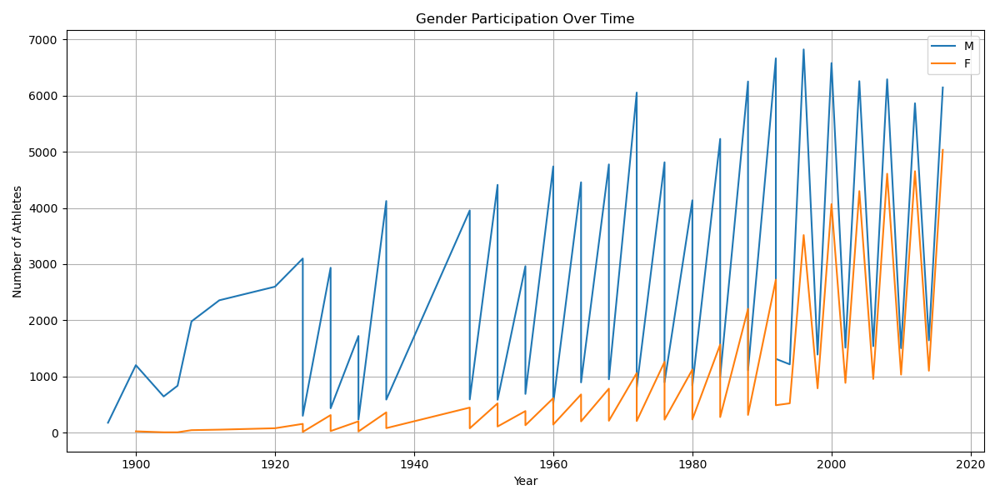
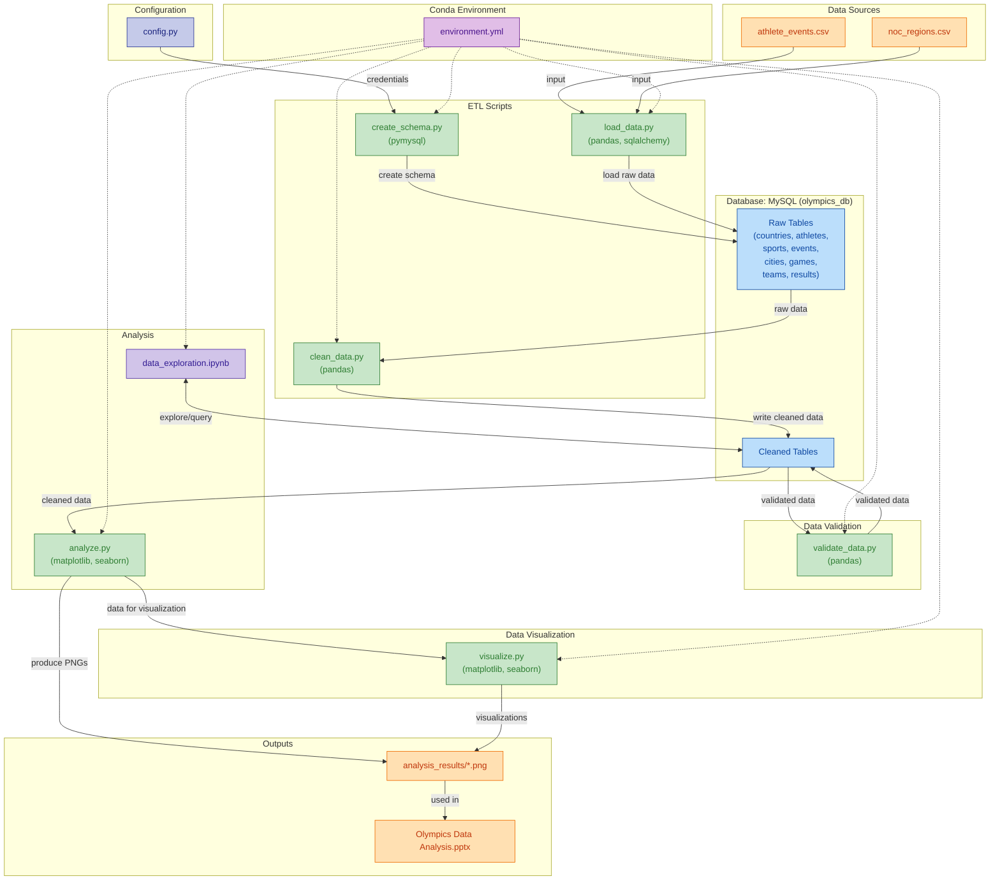

# Olympics Data Analysis

A comprehensive data analysis project for Olympic Games historical data, developed by Ahmed Abdelwahed as an assessment project for Stage One of the Data Engineering track @IEEE Mansoura Computer Society Chapter.

## Project Description

This project provides a robust system for analyzing historical Olympic Games data, including athlete performance, medal distributions, and participation trends across different sports and countries. It features a complete data pipeline from raw data processing to insightful visualizations, all backed by a well-structured MySQL database.

## Dataset Source

The dataset used in this project is sourced from Kaggle:
[120 Years of Olympic History: Athletes and Results](https://www.kaggle.com/datasets/heesoo37/120-years-of-olympic-history-athletes-and-results)

This dataset contains historical data on the modern Olympic Games, including all the Games from Athens 1896 to Rio 2016. It includes information about athletes, events, medals, and more.

## Tech Stack

<p>
    
    
    
    
    
    
    
</p>

## Installation

1. Clone the repository:

   ```bash
   git clone https://github.com/yourusername/Olympics-Data-Analysis.git
   cd Olympics-Data-Analysis
   ```

2. Create and activate the Conda environment:

   ```bash
   conda env create -f environment.yml
   conda activate olympics-project
   ```

3. Set up MySQL database:
   - Install MySQL if not already installed
   - Create a new database named `olympics_db`
   - Update the database configuration in `scripts/config.py` with your MySQL credentials:

     ```python
     MYSQL_CONFIG = {
         'host': 'localhost',
         'port': 3306,
         'user': 'your_username',
         'password': 'your_password',
         'database': 'olympics_db'
     }
     ```

## Usage

The project follows a sequential workflow:

1. Create the database schema:

   ```bash
   python scripts/create_schema.py
   ```

2. Load the initial data:

   ```bash
   python scripts/load_data.py
   ```

3. Clean and process the data:

   ```bash
   python scripts/clean_data.py
   ```

4. Run the analysis:

   ```bash
   python scripts/analyze.py
   ```

The analysis results will be saved in the `analysis_results` directory as PNG files:

## Analysis Results

The project generates several insightful visualizations:

### Medal Distribution by Country


*Top 10 countries by medal count, showing the distribution of Gold, Silver, and Bronze medals*

### Athlete Performance Trends


*Historical trends in athlete statistics including age, height, and weight*

### Sports Distribution


*Distribution of sports and events across the Olympic Games*

### Gender Participation


*Evolution of gender participation in the Olympic Games over time*

## Project Structure

## Data Pipeline Flowchart

Below is a high-level flowchart illustrating the data pipeline, ETL process, and analysis workflow for this project:



## Database Schema

The project uses a normalized database schema with the following structure:

### Entity Relationship Diagram (ERD)


### Database Relationships

The database schema implements a comprehensive set of relationships that maintain referential integrity and support efficient data querying:

#### One-to-Many (1:N) Relationships

- **Countries → Results**: A country (identified by NOC) can have multiple Olympic results
- **Athletes → Results**: An athlete can participate in multiple Olympic events
- **Sports → Events**: A sport can contain multiple competitive events
- **Events → Results**: An event can have multiple participant results
- **Cities → Games**: A city can host multiple Olympic Games (e.g., London hosted in 1908, 1948, and 2012)
- **Games → Results**: An Olympic Games can contain multiple event results
- **Teams → Results**: A team can participate in multiple events

#### Many-to-Many (M:N) Relationships

The following many-to-many relationships are implemented through the results table as a junction table:

- **Athletes ↔ Events**:
  - An athlete can participate in multiple events
  - An event can have multiple participating athletes
  - Junction: results table with athlete_id and event_id
- **Athletes ↔ Games**:
  - An athlete can compete in multiple Olympic Games
  - An Olympic Games can have multiple participating athletes
  - Junction: results table with athlete_id and game_id
- **Teams ↔ Events**:
  - A team can participate in multiple events
  - An event can have multiple participating teams
  - Junction: results table with team_id and event_id

#### One-to-One (1:1) Relationships

- **Events ↔ Sports**: Each event is uniquely associated with one sport (enforced by event.sport_id foreign key)

## License

This project is part of the IEEE Mansoura Computer Society Chapter's Data Engineering track stage one evaluation process. All rights reserved.
